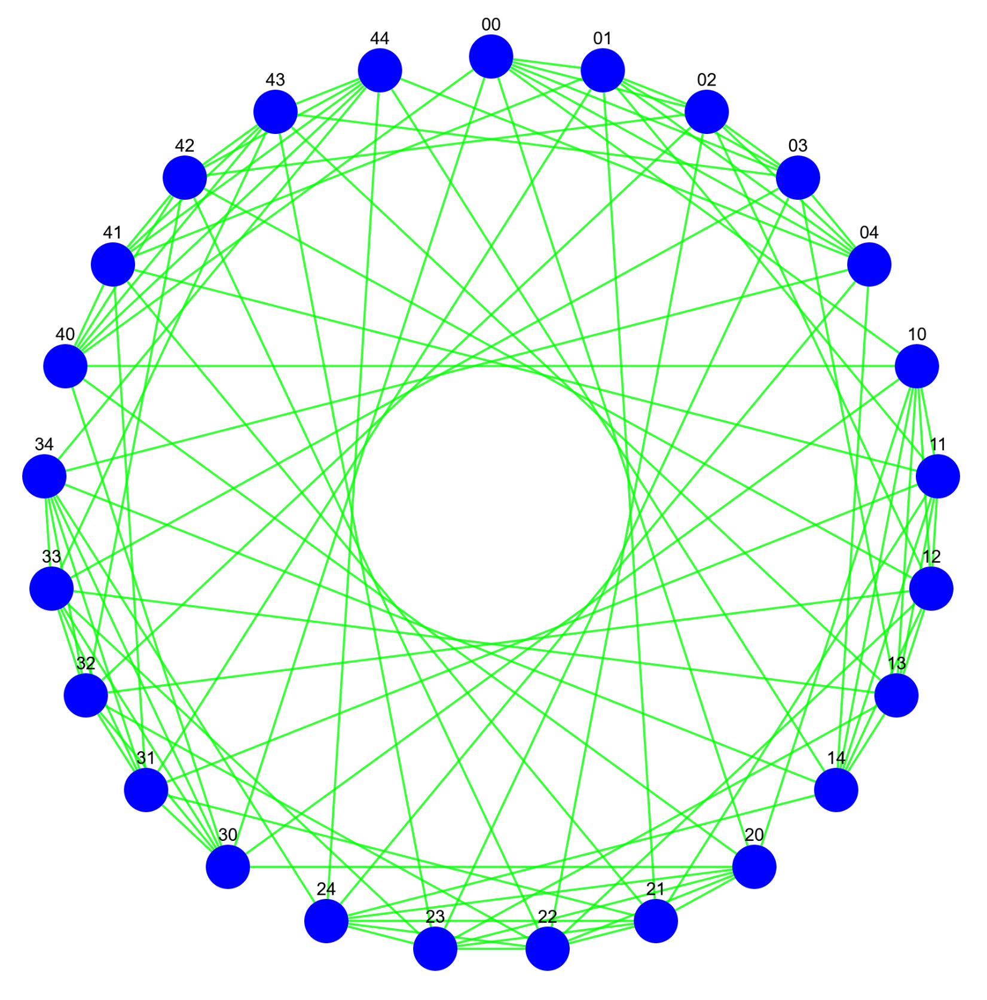

# Cayley graphs generator

- **Author:** Jozef Zaťko
- **Year:** 2017

### Project description
JavaEE web application generating Cayley graphs of cyclic groups Zn x Zn. It finds Cayley graph of given n with minimal vertex degree.

### Documentation
    
- [Dokumentácia](https://github.com/jozefzatko/cayley/blob/master/prezentacia.pdf/)

### Technologies used:
- JavaEE 7
- JAX-RS (Jersey + Jackson)
- [cytoscape.js](https://github.com/cytoscape/cytoscape.js)
- Maven, Log4j, JUnit
